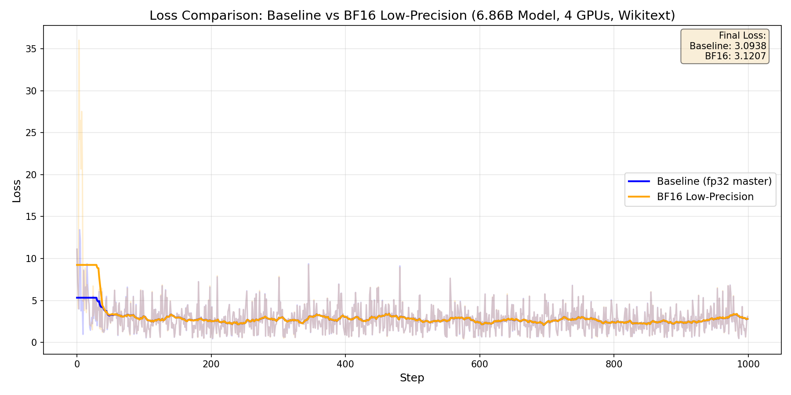

# BF16 Low-Precision Master Weights and Optimizer States

This example demonstrates DeepSpeed's [new low-precision training options](https://github.com/deepspeedai/DeepSpeed/pull/7700) that can significantly reduce memory usage:

- `bf16_master_weights_and_grads`: Keep master parameters and gradients in BF16 instead of FP32
- `bf16_optimizer_states`: Keep optimizer states (e.g., Adam moments) in BF16


### Running an Example

The following commands run training for 1000 steps on the Wikitext-103 dataset using both the baseline and BF16 low-precision configurations, then generates a loss comparison plot.
The model has approximately 6.86 billion parameters (hidden=4096, layers=32, heads=32, batch=1, seq=512).
For BF16 low-precision training, we use `torch.autocast`. ZeRO stage is set to 3 for both.

```bash
# Run 1000 steps with wikitext dataset
deepspeed --num_gpus=4 train.py --deepspeed_config configs/baseline.json \
  --num_layers 32 --hidden_dim 4096 --num_heads 32 --batch_size 1 \
  --num_steps 1000 --activation_checkpointing \
  --loss_log_file logs/baseline_loss.csv --use_real_data --seed 42

deepspeed --num_gpus=4 train.py --deepspeed_config configs/bf16_full.json \
  --num_layers 32 --hidden_dim 4096 --num_heads 32 --batch_size 1 \
  --num_steps 1000 --activation_checkpointing \
  --loss_log_file logs/bf16_full_loss.csv --use_real_data --seed 42

# Generate comparison plot
python plot_loss.py --baseline logs/baseline_loss.csv --bf16 logs/bf16_full_loss.csv \
  --output loss_comparison.png
```

Here is a summary of the memory usage and training time results using 4xH100.
This shows a significant memory reduction: Memory reduction: 9.57 GB allocated (37%), 12.45 GB peak (39.7%)**.

| Configuration | Allocated Memory | Peak Memory | Avg Step Time |
|---------------|------------------|-------------|---------------|
| Baseline (fp32 master) | 25.74 GB | 31.38 GB | 0.6016s |
| BF16 low-precision (master + opt states) | **16.17 GB** | **18.93 GB** | 0.6427s |


## Loss Curve Comparison

To verify that BF16 low-precision training maintains numerical stability, we trained for 1000 steps on the Wikitext-103 dataset:



| Configuration | Final Loss | Mean Loss | Loss Std |
|---------------|------------|-----------|----------|
| Baseline (fp32 master) | 3.09 | 2.78 | 1.56 |
| BF16 Low-Precision | 3.12 | 2.90 | 2.37 |

The loss curves show that both configurations converge similarly, demonstrating that the reduced precision does not significantly impact training quality while providing substantial memory savings.

### Memory Breakdown

For a model with N parameters:

| Component | Baseline | BF16 Low-Precision |
|-----------|----------|-------------------|
| Model params | 2N bytes (BF16) | 2N bytes (BF16) |
| Gradients | 2N bytes (BF16) | 2N bytes (BF16) |
| Master weights | 4N bytes (FP32) | 2N bytes (BF16) |
| Master Gradients | 4N bytes (FP32) | 2N bytes (BF16) |
| Adam momentum | 4N bytes (FP32) | 2N bytes (BF16) |
| Adam variance | 4N bytes (FP32) | 2N bytes (BF16) |
| **Total** | **20 bytes** | **12N bytes** |

Note that DeepSpeed ZeRO partitions model states across multiple GPUs. ZeRO Stage 1 partitions master parameters, gradients, and Adam’s momentum and variance. ZeRO Stage 2 additionally partitions gradients. With ZeRO Stage 3, all of these model states are partitioned.

With ZeRO-3, BF16 low-precision configurations provide a theoretical ~40% reduction in optimizer-related memory. Actual savings depend on activation memory and other factors, but our results show a close match to the theoretical estimate.

## Related Resources

- [DeepSpeed BF16 Documentation](https://www.deepspeed.ai/docs/config-json/#bf16-training-options)
- [Low-precision master params PR](https://github.com/deepspeedai/DeepSpeed/pull/7700)
